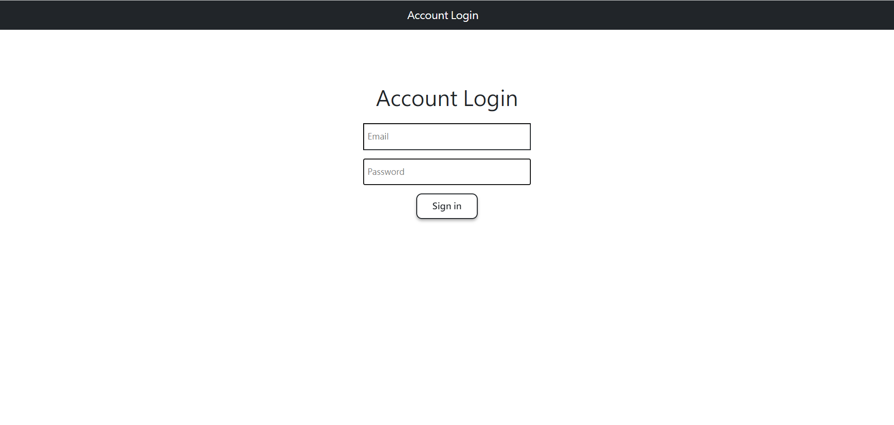
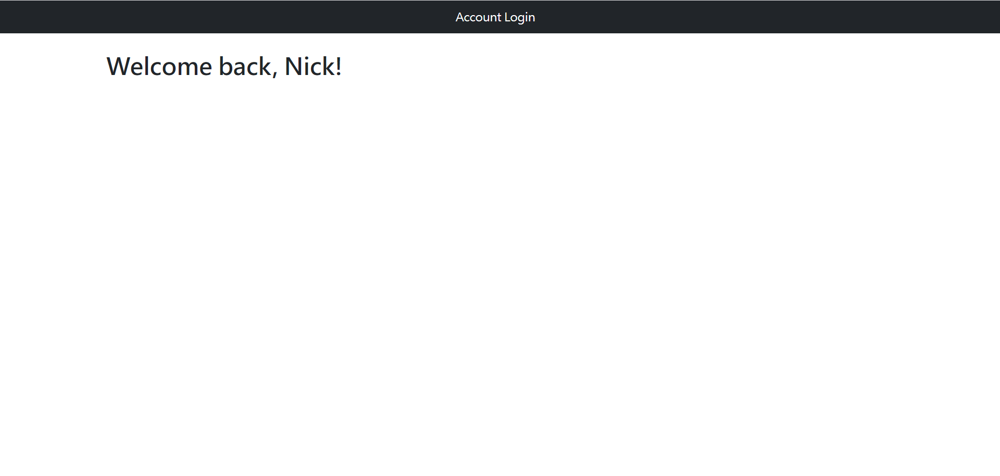

# Login 

使用者輸入帳號密碼，可登入。

## 功能介紹
* 使用者登入。

## 首頁瀏覽



## 登入成功瀏覽




## 環境建置與需求 
* npm 
* node.js 

## 安裝
1. 將專案 clone 到本地
2. 透過終端機進入資料夾，輸入:
   ```
   npm install
   ```
3. 載入種子資料:
   ```
   npm run seed
   ```
  載入成功會顯示:
  "users import done"
4. 輸入:
   ```
   npm run dev
   ```
5. 看見此行訊息則代表順利運行:
   "In port 3000 now!"
6. 請在瀏覽器輸入以下網址:
   http://localhost:3000
7. 結束使用請在終端機中輸入:
   ```
   ctrl + c
   ```

## 開發工具

* express 4.18.2
* express-handlebars 6.0.6
* mongoose 6.7.0
* nodemon 2.0.20
